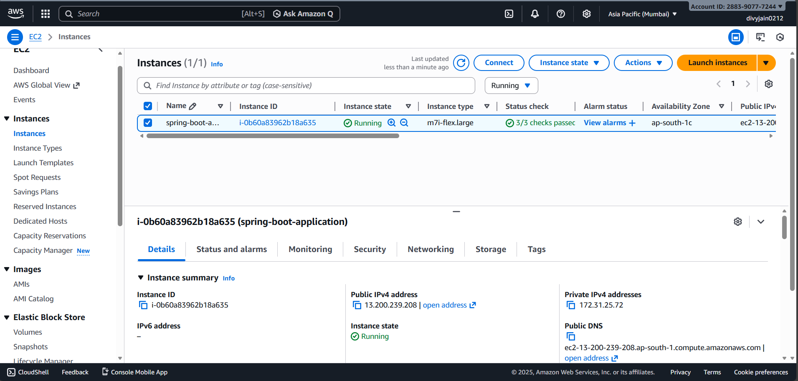
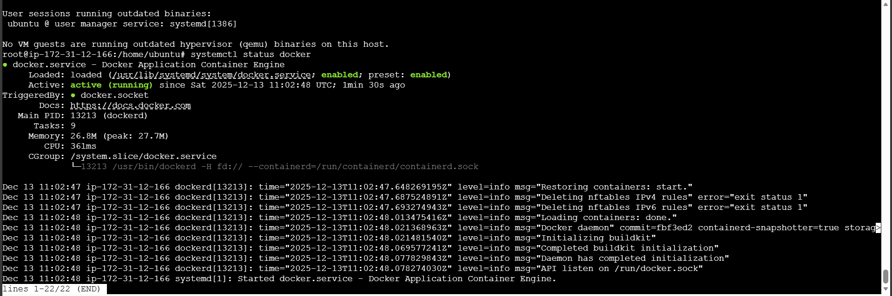
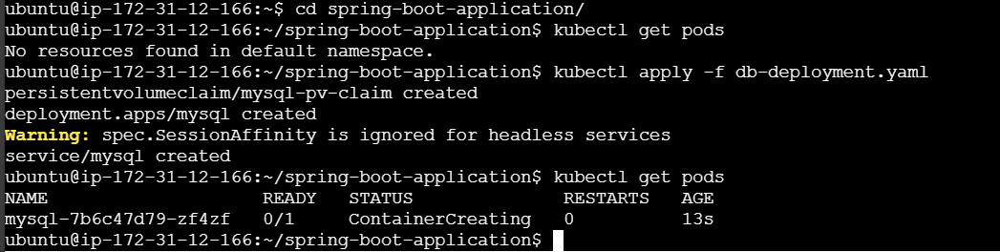

# Deploying a Spring Boot application on a Kubernetes (K8S) cluster, ensuring seamless integration, scalability, and management of the application using Docker, Minikube, and Kubernetes services.

Step-by-Step Implementation:-
# Step 1: Create an EC2 instance

Creating an Ubuntu t2.small instance


# Step 2 — Install the following command in instance

```bash
sudo su
apt update -y
apt upgrade -y
```

# Docker installation

Install using the apt repository
Before you install Docker Engine for the first time on a new host machine, you need to set up the Docker apt repository. Afterward, you can install and update Docker from the repository.

1. Set up Docker's apt repository.
# Add Docker's official GPG key:
```bash
sudo apt update
sudo apt install ca-certificates curl
sudo install -m 0755 -d /etc/apt/keyrings
sudo curl -fsSL https://download.docker.com/linux/ubuntu/gpg -o /etc/apt/keyrings/docker.asc
sudo chmod a+r /etc/apt/keyrings/docker.asc

# Add the repository to Apt sources:
sudo tee /etc/apt/sources.list.d/docker.sources <<EOF
Types: deb
URIs: https://download.docker.com/linux/ubuntu
Suites: $(. /etc/os-release && echo "${UBUNTU_CODENAME:-$VERSION_CODENAME}")
Components: stable
Signed-By: /etc/apt/keyrings/docker.asc
EOF


sudo apt update
```

2. Install the Docker packages.

To install the latest version, run:
```bash
sudo apt install docker-ce docker-ce-cli containerd.io docker-buildx-plugin docker-compose-plugin -y
```

3. The Docker service starts automatically after installation. To verify that Docker is running, use:
```bash
systemctl status docker
```

Some systems may have this behavior disabled and will require a manual start:
```bash
systemctl start docker
```
To run Minikube with the Docker driver without sudo, the user must be added to the docker group.
```bash
sudo usermod -aG docker $USER
newgrp docker
```



# Step 3 — Install Conntrack

conntrack :- In Kubernetes, “conntrack” refers to the Connection Tracking system used for network traffic management within the cluster. Conntrack is a kernel feature that keeps track of network connections and their states. It allows the kernel to maintain information about network connections, such as source IP addresses, destination IP addresses, ports, and connection states (established, closed, etc.)

```bash
apt install conntack
```

# Step 4 — Install and run kubectl and minikube in vm

1. Install and Set Up kubectl on Linux

Download the latest release with the command:
```bash
curl -LO "https://dl.k8s.io/release/$(curl -L -s https://dl.k8s.io/release/stable.txt)/bin/linux/amd64/kubectl"
```

2. Validate the binary (optional)

Download the kubectl checksum file:
```bash
curl -LO "https://dl.k8s.io/release/$(curl -L -s https://dl.k8s.io/release/stable.txt)/bin/linux/amd64/kubectl.sha256"
```

Validate the kubectl binary against the checksum file:
```bash
echo "$(cat kubectl.sha256)  kubectl" | sha256sum --check
```

If valid, the output is:
```bash
kubectl: OK
```

3. Install kubectl
```bash
sudo install -o root -g root -m 0755 kubectl /usr/local/bin/kubectl
```

4. Test to ensure the version you installed is up-to-date:
```bash
kubectl version --client
```

5. To install the latest minikube stable release on x86-64 Linux using binary download:
```bash
curl -LO https://github.com/kubernetes/minikube/releases/latest/download/minikube-linux-amd64
sudo install minikube-linux-amd64 /usr/local/bin/minikube && rm minikube-linux-amd64
```

6. From a terminal with administrator access (but not logged in as root), run:
```bash
minikube start
```

# Step 5- Clone the git repository

```bash
git clone https://github.com/Divyjain0212/spring-boot-application.git
```

# Step 6 — Now we will start setting up Database

```bash
cd spring-boot-application
kubectl apply -f db-deployment.yaml
kubectl get pods
```



check database and it’s content so go inside the container as , ( password is root ) so we can see the db create from the container
```bash
kubectl exec -it pod/mysql-7b6c47d79-zf4zf -- /bin/bash
mysql -u root -p
```

After that exit from the shell also container.

# Step 7 — Create an image from Dockerfile

```bash
docker build -t divyj0212/spring-boot-application .

#check the docker images 
docker images
```

Now push that image to dockerhub so first you have to login to dockerhub and then push that image to docker hub

```bash
docker login

docker push divyj0212/spring-boot-application
```

# Step 8 — now create app-deployment.yml file and check pods and check service

```bash
kubectl apply -f app-deployment.yaml
kubectl get pods
kubectl get svc
```

# Step 9 - PORT-FORWARDING

Port forwarding is a networking technique used to redirect network traffic from one port on a host to another port on a different host or the same host. In the context of Kubernetes, port forwarding allows you to access services running inside a Kubernetes cluster from your local machine or another remote host.

```bash
kubectl port-forward --address 0.0.0.0 svc/springboot-crud-svc 8080:8080 &
```

# Step 10 - Now we will open the Dashboard of K8S. Inside EC2 our minikube is running so we are setting a proxy for all the local address.The proxy server is started on port 8001.

```bash
kubectl proxy --address='0.0.0.0' --accept-hosts='^*$'
```

Now open another terminal and run below command.
```bash
minikube dashboard
```

```bash
http://127.0.0.1:34927/api/v1/namespaces/kubernetes-dashboard/services/http:kubernetes-dashboard:/proxy/
change the IP address to your IP address and port mention as 8001

e.g http://54.190.118.228:8001/api/v1/namespaces/kubernetes-dashboard/services/http:kubernetes-dashboard:/proxy/
```

By changing the ip address and port number you can access the k8s resources on dashboard using above link.